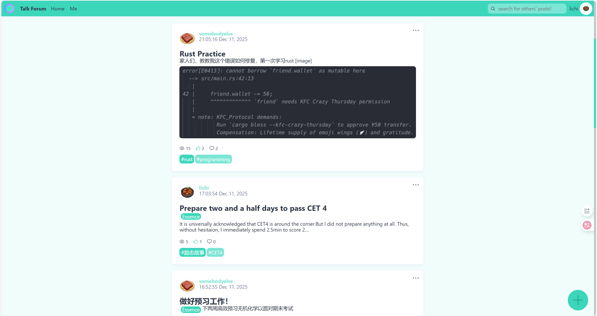
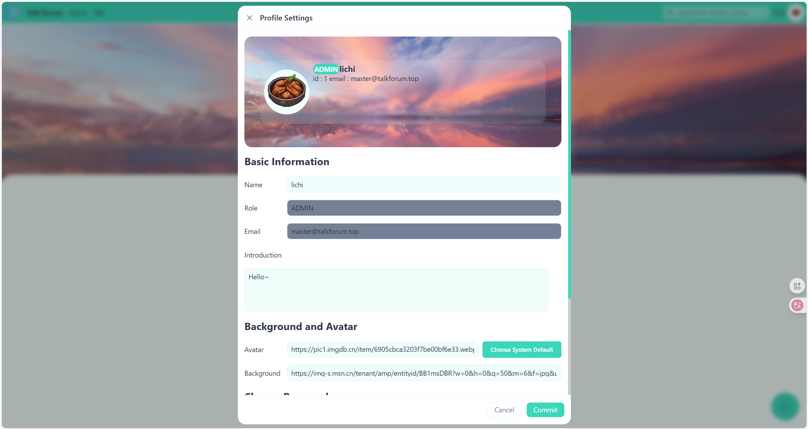
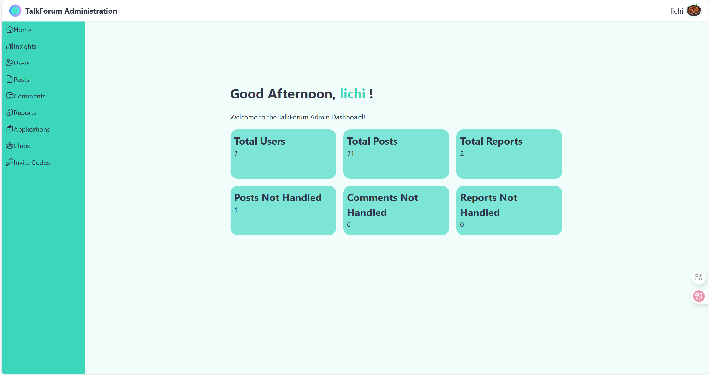
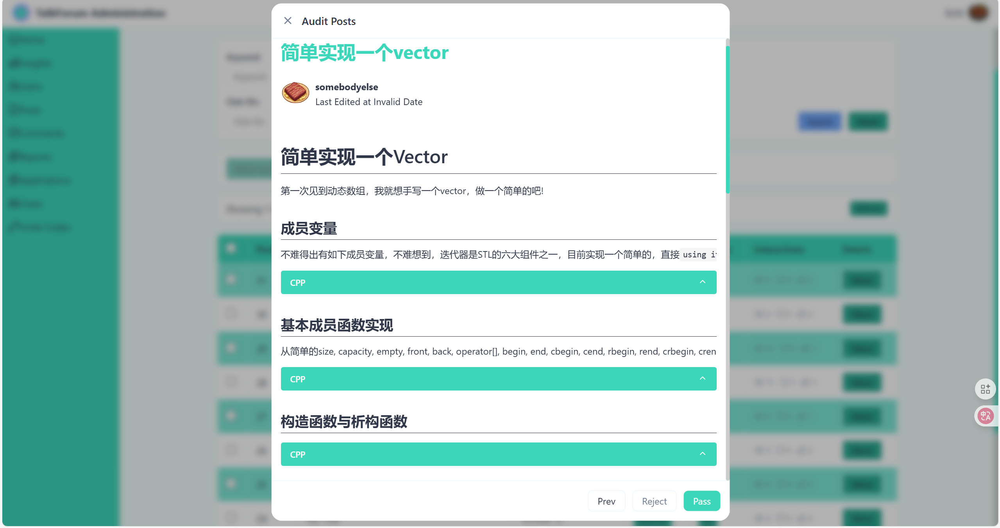
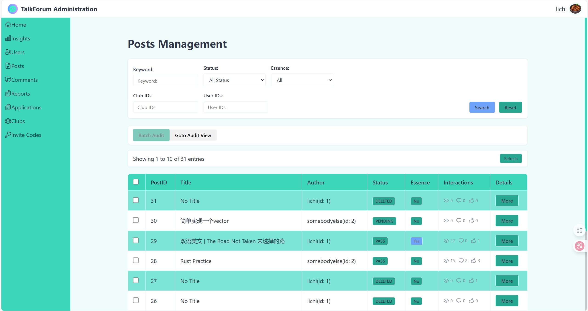
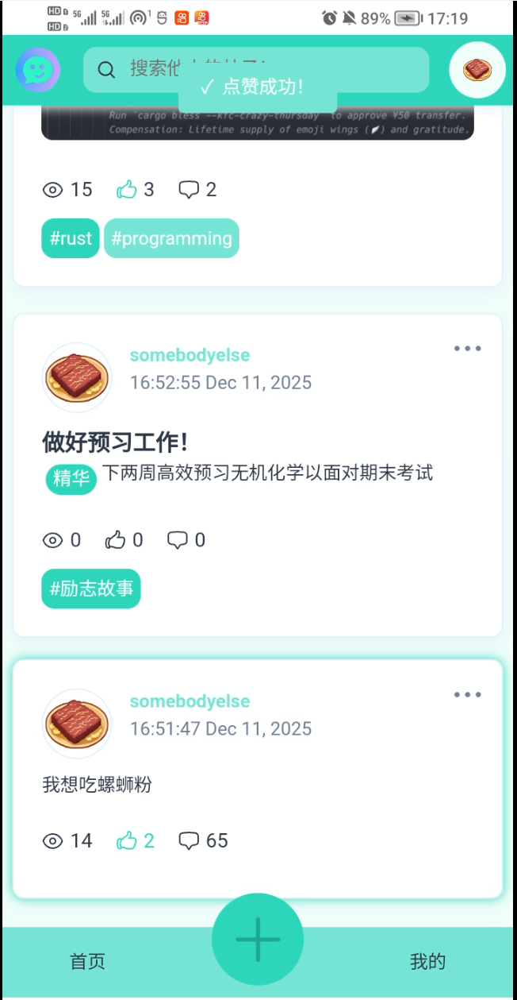
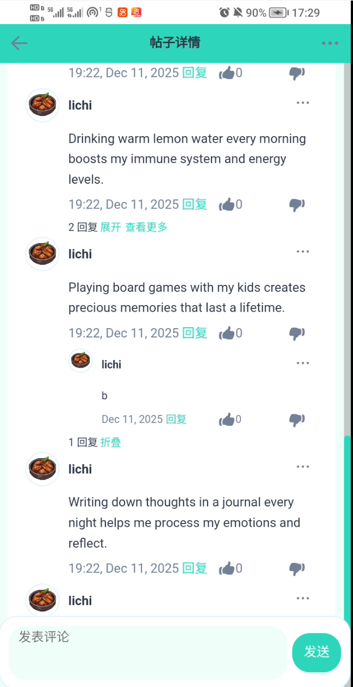
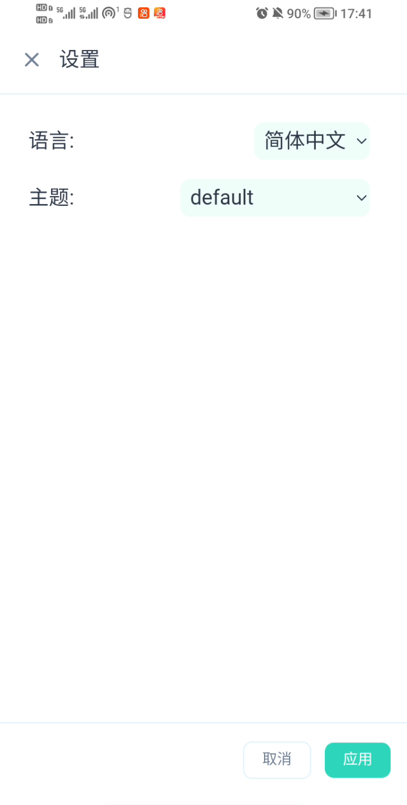
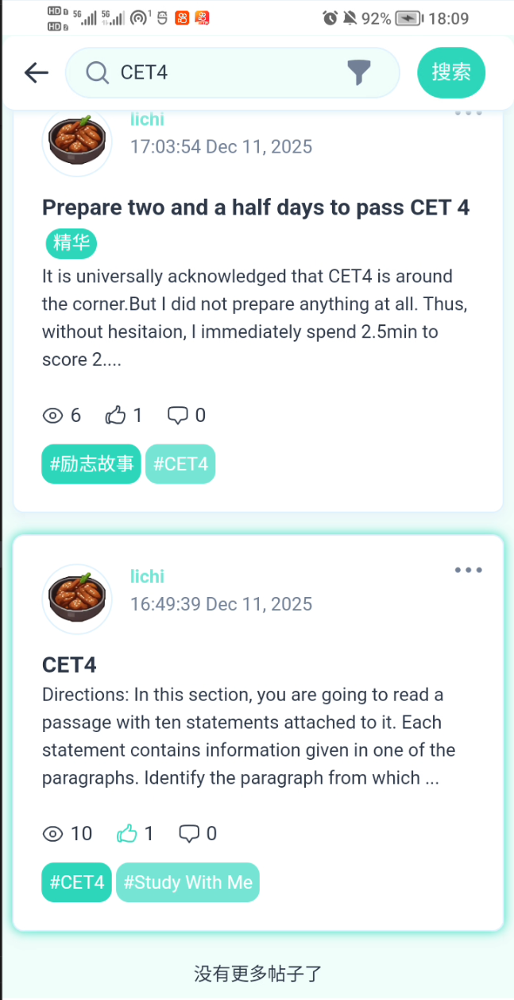

# Talk Forum（聊吧）
## 什么是Talk Forum
Talk Forum（聊吧）是一个简易的论坛系统，致力于设计一个轻量化、易用性强且具备可扩展性的在线交流平台。用户可通过该平台发布话题、参与讨论、互动交流，实现信息共享与思想碰撞，满足中小型社区的基础交流需求。

## 实现目的

1.基本登录、用户相关功能
2.数据库增删改查
3.多页面网站，包含页面间传参
4.自拟主题和内容

## 运用内容

**前端：**
核心框架：React 18+TypeScript（组件化开发，提升UI复用性与维护性，运用Typescript的类型约束可以清晰看出调用参数类型）
状态管理：Redux + Redux Toolkit（管理全局状态，如用户信息、帖子数据、登录状态等）
构建工具：Vite（优化开发体验，提升热更新速度与生产环境打包效率）
网络请求：Axios（处理前后端数据交互，支持请求/响应拦截、错误统一处理）
路由管理：React Router 6（实现页面跳转，支持嵌套路由、路由守卫控制访问权限）
国际化：react-i18next（实现国际化，可以根据本地浏览器语言策略显示对应语言文本）

**后端：**
核心框架：Spring Boot 3（简化后端开发，快速构建RESTful API）
数据持久化：MyBatis（简化数据库操作，支持CRUD及复杂查询）
数据库：MySQL（存储用户、帖子、评论等核心业务数据）
缓存：Redis（储存JWT，目前仅用于登录登出和限流）

## 运行项目

前端项目储存在`/TalkForum`文件夹  [页面参考规范请点击](./聊吧论坛前端页面规范.md)

```powershell
pnpm build
```

后端项目储存在`/TalkForumServer`文件夹，修改`appplication.yml`修改，[接口参考规范请点击](./聊吧论坛后端接口规范.md)

```powershell
mvn clean package -Dmaven.test.skip=true
```

使用`MySQL`作为数据库，[数据库表参考规范请点击](./聊吧论坛数据库表规范.md)，执行`init_database.sql`一键构建数据库`test_data.sql`构建默认数据，所有用户密码均为Qu123456!

## 简要细节

登录过程：用户填写好表单后发送至后端服务，后端验证账号密码成功后，通过响应头Set-Cookie将JWT Token设置为HttpOnly Cookie（前端由浏览器自动存储，无法通过JS操作），同时将Token与用户ID的绑定关系存储到Redis中，用于后续有效性校验

限流过程：运用Redis的ZSet结构实现滑动窗口限流，将请求唯一标识（简单使用用户的IP）设为member、请求时间戳设为score；通过ZREMRANGEBYSCORE命令移除score（时间戳）小于「当前时间-窗口大小」的历史请求，再用ZCARD命令统计窗口内剩余请求数。后端通过Interceptor结合自定义注解，实现不同接口/角色的差异化限流规则

鉴权过程：通过自定义权限注解（如@LoginRequired, @AdminRequired）搭配Interceptor，在请求处理前加入权限判断逻辑（校验用户角色、资源归属），防止垂直越权和水平越权问题

主题选择器：运用AI赋能的配色方案，让用户选择不同的精美主题；用户未设置时自动识别当前系统主题，打造舒适的视觉体验

国际化：根据浏览器语言策略判断用户语言倾向，展示对应的语言版本；若检测的语言未适配，则以默认英文兜底

 无限滚动容器：基于InfiniteScroll库实现无限滚动功能，搭配骨架屏加载效果，缓解用户刷帖时的等待焦虑

### 作品展示



















